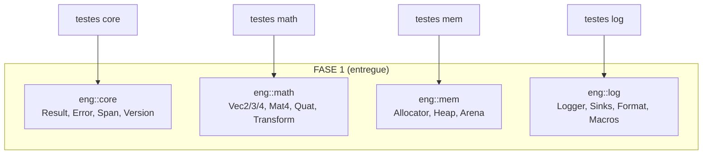
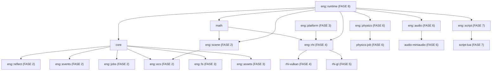

# Arquitetura — Visão Geral (FASE 1)

> Documento normativo do grafo de dependências entre módulos (PARTE 2 do
> contrato). **Regra:** dependências unidirecionais, sem ciclos; nenhum módulo
> `engine/*` inclui headers de `android/`, `editor/` ou de backends de outros
> módulos.

## Estado atual (FASE 1 — §17.1)

A FASE 1 entrega os quatro módulos fundacionais. Eles são deliberadamente
**independentes** (fundações não dependem de nada), o que garante grafo acíclico
por construção:



**Matriz de adjacência (FASE 1):**

| Módulo | Depende de |
|---|---|
| `eng::core` | — |
| `eng::math` | — |
| `eng::mem` | — |
| `eng::log` | — |
| executáveis de teste | módulo testado + Catch2 (externa) |

Decisão registrada: `eng::mem` reporta vazamentos via `fprintf(stderr)` no
destrutor do `HeapAllocator` em vez de usar `eng::log`. Motivo: introduzir a
aresta `mem → log` criaria um precedente de camada invertida (log é consumidor
de memória, não o contrário) e um risco de ciclo quando `eng::log` adotar
alocadores de `eng::mem` em fases futuras. A API expõe `hasLeaks()`/`stats()`
para que o runtime reporte via logger quando existir.

## Módulos planejados (grafo alvo, por fase)

Arestas futuras — **referência de projeto, não código existente**:



Regras que mantêm o grafo acíclico conforme os módulos entram:

1. Módulos de **interface** (`eng::rhi`, `eng::physics`, ...) nunca incluem
   headers de **backends** (`rhi-vulkan`, `physics-jolt`, ...). Backends
   implementam interfaces e são linkados no executável final.
2. Fundações (`core`, `math`, `mem`, `log`) nunca ganham dependências para
   módulos de nível superior.
3. `android/`, `editor/` são consumidores de `engine/` — nunca o contrário.

## Isenções de política de compilação (registradas)

- **ADR-004 (sem exceções):** válido para as bibliotecas `eng::*`
  (`-fno-exceptions`). Executáveis de **teste** mantêm exceções habilitadas
  porque Catch2 as exige para reportar falhas.
- **ADR-005 (sem RTTI):** válido para bibliotecas `eng::*` **e** executáveis de
  teste (`-fno-rtti` em ambos — `eng_apply_test_policy`). Motivo técnico: com
  RTTI habilitado nos testes, o GCC emite referências a `typeinfo` de classes
  polimórficas do motor que os TUs `-fno-rtti` nunca definem, quebrando o link.
  Catch2 v3.5.2 compila limpo sem RTTI nesta configuração.
- **C++20 modules:** desativados (`CMAKE_CXX_SCAN_FOR_MODULES OFF`) — a
  varredura automática do CMake injeta `-fmodules-ts`, que conflita com a
  combinação lib(`-fno-rtti`) + testes ao linkar. Reavaliar quando módulos
  forem adotados de fato.

## Layout de módulo (padrão para todos os `engine/*`)

```
engine/<módulo>/
├── CMakeLists.txt        # eng_add_module(<módulo> ...) + testes
├── include/eng/<módulo>/ # headers públicos
├── src/                  # implementação (.cpp)
└── tests/                # testes Catch2 v3
```
