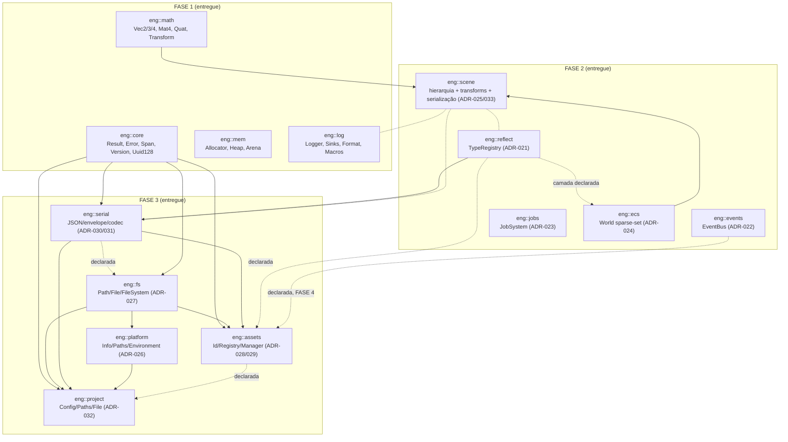
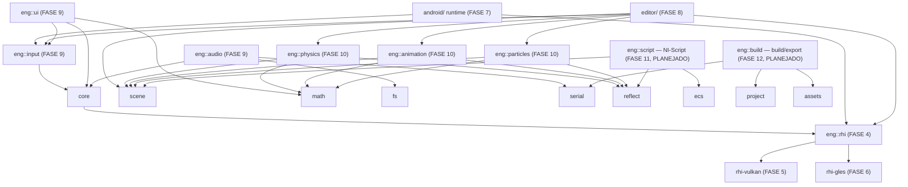

# Arquitetura — Visão Geral (FASE 3)

> Documento normativo do grafo de dependências entre módulos (PARTE 2 do
> contrato). **Regra:** dependências unidirecionais, sem ciclos; nenhum módulo
> `engine/*` inclui headers de `android/`, `editor/` ou de backends de outros
> módulos.

## Estado atual (FASE 1 + 2 + 3 — entregues)

A FASE 1 entrega quatro módulos fundacionais **independentes**. A FASE 2
entrega cinco módulos sobre a fundação. A FASE 3 entrega as camadas de
persistência — `fs`, `platform`, `serial`, `assets`, `project` — e a
serialização de Scene/ECS (que vive DENTRO de `eng::scene`, ADR-033/D3):



**Matriz de adjacência (entregue):**

| Módulo | Depende de | ADR |
|---|---|---|
| `eng::core` | — | — |
| `eng::math` | — | — |
| `eng::mem` | — | — |
| `eng::log` | — | — |
| `eng::reflect` | core (declarada) | [021](../adr/ADR-021-reflection-strategy.md) |
| `eng::events` | core (declarada) | [022](../adr/ADR-022-events-lifetime.md) |
| `eng::jobs` | core (declarada) | [023](../adr/ADR-023-jobs-architecture.md) |
| `eng::ecs` | core, reflect (declaradas) | [024](../adr/ADR-024-ecs-storage.md) |
| `eng::scene` | core, ecs, math (+ serial, reflect, log — serialização, ADR-033) | [025](../adr/ADR-025-scene-hierarchy.md) · [033](../adr/ADR-033-scene-serialization.md) |
| `eng::fs` | core, log | [027](../adr/ADR-027-filesystem-abstraction.md) |
| `eng::platform` | core, log, **fs** | [026](../adr/ADR-026-platform-fs-boundary.md) |
| `eng::serial` | core, reflect, fs (declarada) + nlohmann/json | [030](../adr/ADR-030-serialization-format.md) · [031](../adr/ADR-031-serialization-versioning.md) |
| `eng::assets` | core, fs, serial, reflect, events (declarada — FASE 4) | [028](../adr/ADR-028-asset-identity.md) · [029](../adr/ADR-029-asset-lifecycle.md) |
| `eng::project` | core, fs, serial, platform, assets/log (declaradas) | [032](../adr/ADR-032-project-structure.md) |
| `eng::rhi` | core, log | [035](../adr/ADR-035-rhi-abstraction.md) · [036](../adr/ADR-036-rhi-selection.md) |
| `eng::rhi::vulkan` (backend) | rhi | [037](../adr/ADR-037-vulkan-backend.md) |
| `eng::rhi::gles` (backend) | rhi | [038](../adr/ADR-038-gles-backend.md) |
| `android/runtime` (consumidor) | rhi, rhi::vulkan, rhi::gles, log | [039](../adr/ADR-039-android-activity-jni-renderthread.md) · [040](../adr/ADR-040-android-surface-ownership.md) |
| `tests/` (raiz) | TODOS — integração e2e | — |
| executáveis de teste | módulo testado + Catch2 (externa) | — |

Regras duras da FASE 3 (missão §5.1), verificadas: `eng::fs` NÃO depende
de `eng::platform`; `eng::assets` NÃO depende de `eng::jobs`; NENHUM
módulo novo depende de Vulkan/OpenGL/Android/JNI; nenhum módulo depende
de `eng::scene` exceto `tests/` (por isso a serialização de cena vive
DENTRO de scene — ADR-033, desvio D3 da auditoria em
[phase3_audit.md](../phase3_audit.md)).

Documentação por módulo: [13-rhi](13-rhi.md) · [14-rhi-vulkan](14-rhi-vulkan.md) · [15-rhi-gles](15-rhi-gles.md) · [02-reflect](02-reflect.md) ·
[03-events](03-events.md) · [04-jobs](04-jobs.md) ·
[05-ecs](05-ecs.md) · [06-scene](06-scene.md) · [07-fs](07-fs.md) ·
[08-platform](08-platform.md) · [09-serial](09-serial.md) ·
[10-assets](10-assets.md) · [11-project](11-project.md) ·
[12-scene-serialization](12-scene-serialization.md).

Decisão registrada: `eng::mem` reporta vazamentos via `fprintf(stderr)` no
destrutor do `HeapAllocator` em vez de usar `eng::log`. Motivo: introduzir a
aresta `mem → log` criaria um precedente de camada invertida (log é consumidor
de memória, não o contrário) e um risco de ciclo quando `eng::log` adotar
alocadores de `eng::mem` em fases futuras. A API expõe `hasLeaks()`/`stats()`
para que o runtime reporte via logger quando existir.

## Módulos por fase (grafo real)

Implementações PRÓPRIAS — sem jolt, sem miniaudio, sem Lua (decisões
registradas em ADR-048 e na missão da FASE 11):



Regras que mantêm o grafo acíclico conforme os módulos entram:

1. Módulos de **interface** (`eng::rhi`, `eng::physics`, ...) nunca incluem
   headers de **backends** (`rhi-vulkan`, ...). Backends implementam
   interfaces e são linkados no executável final.
2. Fundações (`core`, `math`, `mem`, `log`) nunca ganham dependências para
   módulos de nível superior.
3. `android/`, `editor/` são consumidores de `engine/` — nunca o contrário. (FASE 7: `android/` — runtime + APK; `jni.h` em exatamente DOIS arquivos, `GoniJni.cpp` e `EditorJni.cpp`. FASE 8: `editor/` — núcleo C++ do editor, testado no Linux e embutido no APK; ver `docs/architecture/16-editor.md`.)
4. (FASE 3) Nenhum módulo depende de `eng::scene` exceto `tests/` — a
   serialização de cena vive DENTRO de scene (ADR-033).

## Isenções de política de compilação (registradas)

- **ADR-004 (sem exceções):** válido para as bibliotecas `eng::*`
  (`-fno-exceptions`). Executáveis de **teste** mantêm exceções habilitadas
  porque Catch2 as exige para reportar falhas. Dependência nlohmann/json
  (FASE 3): usada APENAS pelas vias que não lançam, por construção do
  wrapper `eng::serial::JsonValue` (ADR-030).
- **ADR-005 (sem RTTI):** válido para bibliotecas `eng::*` **e** executáveis de
  teste (`-fno-rtti` em ambos — `eng_apply_test_policy`). Motivo técnico: com
  RTTI habilitado nos testes, o GCC emite referências a `typeinfo` de classes
  polimórficas do motor que os TUs `-fno-rtti` nunca definem, quebrando o link.
  Catch2 v3.5.2 compila limpo sem RTTI nesta configuração. A FASE 3 não usa
  RTTI em lugar nenhum (type-erasure por TypeTag/keys — ADR-029/033).
- **C++20 modules:** desativados (`CMAKE_CXX_SCAN_FOR_MODULES OFF`) — a
  varredura automática do CMake injeta `-fmodules-ts`, que conflita com a
  combinação lib(`-fno-rtti`) + testes ao linkar. Reavaliar quando módulos
  forem adotados de fato.
- **Headers de dependências como SYSTEM (FASE 3):** nlohmann/json tem seus
  includes marcados SYSTEM para os consumidores — os warnings do projeto
  (ADR-020) aplicam-se ao NOSSO código; dependências compilam com seus
  flags nativos (padrão já registrado em EngineWarnings.cmake).

## Layout de módulo (padrão para todos os `engine/*`)

```
engine/<módulo>/
├── CMakeLists.txt        # eng_add_module(<módulo> ...) + testes
├── include/eng/<módulo>/ # headers públicos
├── src/                  # implementação (.cpp)
└── tests/                # testes Catch2 v3 (unitários do módulo)

tests/                    # integração e2e (FASE 3): única camada que
                          # compõe scene+assets+project (missão §5.1)
```
